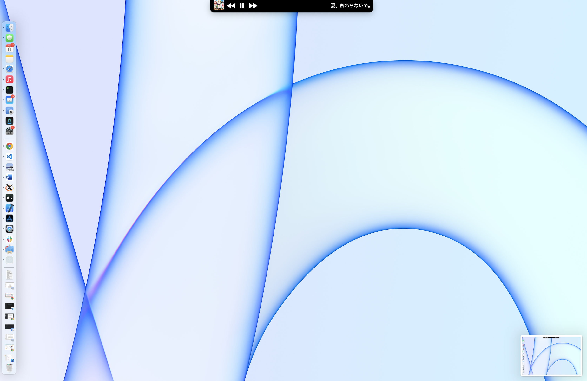

# Static Shima

Just for fun! But it actually looks not that bad.

A static (for the moment) shima (しま, 島, meaning island in Japanese) for MacBooks with a notch. (Well, in fact you can run it on any screen, notch is not a requirement here :D

## Screenshot


## Compile
```shell
xcodebuild -configuration Release
```

